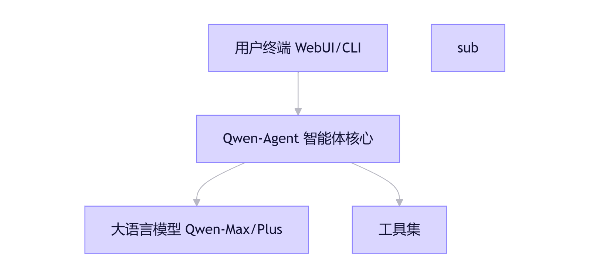

### 基于 Qwen-Agent 的智能知识库问答系统需求文档

#### 一、项目背景与目标

**1.1 项目背景**
随着企业数字化转型的深入，内部积累了海量的非结构化数据（如PDF技术文档、Word标书、Excel报表、TXT日志等）。传统的人工检索方式面临查找困难、效率低下、信息遗漏等痛点。

本项目旨在利用阿里巴巴开源的 Qwen-Agent 框架，结合大语言模型（LLM）的语义理解能力与检索增强生成（RAG）技术，构建一个能够理解自然语言、精准检索本地知识库并生成高质量回答的智能问答系统。

**1.2 项目目标**

- **知识资产化**：将散落在本地的各类文档转化为可被AI直接调用的结构化知识。
- **检索智能化**：实现从“关键词匹配”到“语义理解”的跨越，支持模糊提问。
- **交互自然化**：提供类人的对话体验，支持多轮对话与上下文理解。
- **部署私有化**：确保核心数据存储在本地，保障企业数据安全。

#### 二、系统架构设计

本系统基于 Qwen-Agent 框架进行二次开发，采用分层架构设计，主要包含以下核心组件：

**2.1 核心架构图示**

**2.2 技术选型**

- **开发框架**：Qwen-Agent（基于Python）
- **大语言模型**：通义千问 Qwen-Plus 或 Qwen-Max（通过 DashScope API 调用），或本地部署 Qwen2.5-72B-Instruct。
- **向量数据库**： FAISS（轻量级）。
- **嵌入模型**：BGE-M3 或 text-embedding-v2。
- **前端界面**：Qwen-Agent自带的webGUI: Gradio。

#### 三、功能需求详解

**3.1 知识库管理模块**
该模块负责数据的接入与处理，是问答系统的基石。

- **多格式支持**：必须支持 PDF、Word(.docx)、TXT、Markdown、Excel(.xlsx) 等常见格式的解析。
- **智能分块**：能够根据文档结构（如段落、标题）自动进行文本切片，避免语义截断。
- **增量更新**：支持热更新，当本地文件夹新增或修改文档时，系统能自动触发索引重建，无需重启服务。
- **元数据管理**：在索引时保留文件名、页码、上传时间等元数据，以便在回答中通过引用来源标注（如“参考自《技术手册.pdf》第5页”）。

**3.2 智能问答核心**
基于 Qwen-Agent 的 `Assistant` 类进行定制开发。

- **混合检索策略**：
  - **关键词检索**：使用 BM25 算法，确保专有名词（如设备型号、合同编号）的精准匹配。
  - **语义检索**：使用向量 Embedding，解决“怎么修电脑”匹配到“计算机维护指南”的语义泛化问题。
  - **重排序**：在初步召回后，引入 Rerank 模型对结果进行二次排序，提高Top-3相关度。
- **上下文记忆**：利用 Qwen-Agent 的 `Memory` 机制，自动记录历史对话，支持用户追问（例如：“它的价格是多少？” -> “那它的售后服务呢？”）。
- **防幻觉机制**：设置严格的提示词约束，要求模型“仅依据检索到的上下文回答”，若知识库中无相关信息，必须回答“未找到相关资料”，严禁编造。

**3.3 扩展工具能力**
利用 Qwen-Agent 强大的工具调用能力，扩展问答边界。

- **代码解释器**：当用户询问涉及数据统计的问题（如“统计上季度销售额总和”）时，Agent 应能编写并执行 Python 代码进行计算，而非仅靠文本生成。
- **网络搜索**：对于知识库中不存在的最新信息（如“今日天气”或“最新行业政策”），Agent 应能自动调用外部搜索工具补充信息。

#### 四、非功能性需求

**4.1 性能要求**

- **响应速度**：简单问答首字生成时间 < 2秒；复杂检索问答总耗时 < 10秒。
- **并发支持**：支持至少 5 个并发用户同时提问，系统不卡顿。

**4.2 数据安全**

- **本地化存储**：所有上传的文档切片及向量数据必须存储在本地服务器或私有云，严禁上传至公有云训练。
- **权限控制**：预留API鉴权接口，防止未授权访问。

**4.3 可维护性**

- **日志记录**：记录用户的提问、检索到的文档片段及模型生成的完整日志，便于后续优化检索效果。
- **配置化**：模型参数（如 Temperature, Top-P）、检索阈值（Top-K）应支持通过配置文件动态调整。

#### 五、开发实施路线图

**阶段一：环境搭建与原型验证**

- 配置 虚拟 环境，安装 `qwen-agent[rag,code_interpreter]`。
- 接入 DashScope API，跑通基本的 `Assistant` 对话流程。
- 实现基于本地文件夹的简单文件读取与问答。

**阶段二：核心RAG功能开发**

- 集成向量数据库（如 FAISS）。
- 开发文档解析与清洗脚本。
- 实现混合检索逻辑，优化 Prompt 模板。

**阶段三：前端交互与优化**

- 使用 Gradio 搭建 Web 界面，支持流式输出。
- 增加“引用来源”展示功能。
- 进行 bad case 分析，调整检索阈值和重排序策略。
